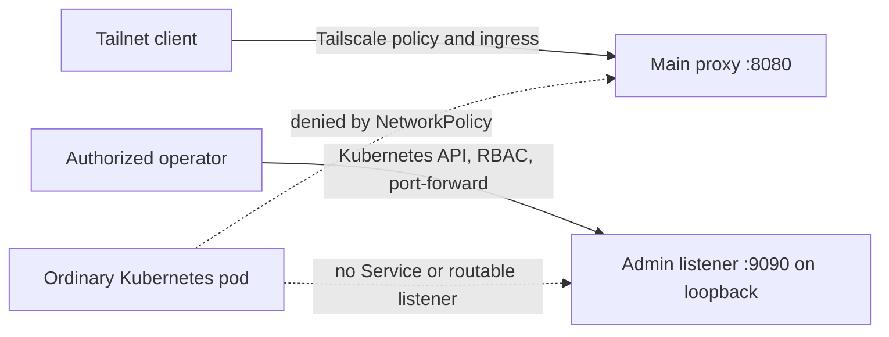

# Spec: Anthropic OAuth Proxy Authorization Boundary Remediation

**Status:** Planned; no remediation is implemented by this document
**Created:** 2026-07-30
**Scope:** Cross-repository boundary decision, with promotion and live-policy
coordination owned by `mothership-gitops`

## Purpose

This document records the authorization model and selected remediation design
for the `anthropic-oauth-proxy` deployment. It consumes the completed Codex
Security assessment from `tailnet-microservices`; it does not rerun that scan,
close its findings, or authorize a deployment.

The immediate problem is not that the application lacks per-client
authentication. The intended main-proxy population is deliberately broad:
tailnet clients may invoke the credential-backed proxy without an additional
application credential. The problem is that ordinary Kubernetes workloads are
outside that population but can currently bypass the Tailscale path through a
ClusterIP. The admin listener has a parallel problem: kubeconfig and Kubernetes
RBAC are intended to authorize operators through `kubectl port-forward`, but an
admin ClusterIP lets ordinary workloads reach the same unauthenticated
listener without exercising either control.

## Assessment Provenance

The source assessment is identified by:

| Item | Identity |
|---|---|
| Codex Security workspace | `1600f1e1-9d9c-4617-a367-980906881381` |
| Completed scan | `01572eaa-b820-4bfe-9bab-9ec9527ff713` |
| Scanned source revision | `73bd2376d4a6cec3b940da9fed6735d340ee9e67` |
| Later source revision reviewed | `b69b962bfa97ec125b0f13a7390c44ce891a8839` |
| Scan manifest SHA-256 | `822f7d1cbfdd659fbf2159c15162b819a4827a405eeaedcb9098400176e3db1d` |

Only CI, documentation, and agent instructions changed between the two source
revisions. None of the files carrying these findings changed, so the handoff
regards the findings as source-current. That is a source-level statement, not
proof of the present cluster state.

The boundary program covers these confirmed high findings:

| Finding | Boundary consequence |
|---|---|
| `csf_f99c254cd45d3dc638c0d417` | Main-proxy ClusterIP bypasses the tailnet-membership boundary |
| `csf_002be178c7a4da1b19e2b7cc` | Admin ClusterIP bypasses kubeconfig and RBAC authorization |
| `csf_5add750c5303459820d27e00` | An unauthorized admin caller can complete OAuth with attacker-selected credentials |
| `csf_f998388e28832b3deff1aeb2` | An unauthorized admin caller can delete active credentials |

The two low-severity PKCE cancellation and disruption findings are downstream
effects of the same admin exposure. They are not separate remediation
projects. Resource exhaustion, telemetry, provider-semantics, configuration
disclosure, and developer-automation findings remain owned by their respective
source or workstation workstreams.

## Evidence Classification

The following facts are source-verified by the supplied assessment:

- The main and admin HTTP surfaces do not require an application credential.
- The rendered workload exposes both surfaces through Kubernetes Services.
- The high-impact OAuth completion and account deletion operations are
  reachable on the admin surface.

The following facts were live-verified during the assessment:

- The Tailscale policy permits every tailnet source to reach every destination
  through a wildcard grant.
- The proxy's Tailscale device uses the shared `tag:k8s` tag.
- The Tailscale Kubernetes Operator uses `tag:k8s-operator`.
- Ordinary pods can technically route to the main and admin ClusterIPs.

The following statements are proposed and must not be described as current
controls until rollout validation succeeds:

- The admin surface will have no cluster-reachable Service and will listen on
  pod loopback for a port-forward-only workflow.
- A NetworkPolicy will deny ordinary workloads access to the main proxy while
  admitting only the actual Tailscale ingress proxy and any proven-required
  probe path.
- Deterministic checks will reject a rendered admin Service or an overly broad
  main-proxy ingress policy.

### Historical Intent Corroboration

A bounded AgentsView finding-history search found no prior decision that
ordinary Kubernetes pods are trusted or authorized proxy clients. The
strongest operational history, session
`a30378fa-13cb-47e8-99df-a35fe036f8c2`, records the main health path on the
Tailscale hostname and the admin workflow through local
`kubectl port-forward`. Sessions
`pi:019f7e95-d339-7093-9a26-1c03d1a06d6b` and
`pi:019f5332-449c-724b-92f0-612202b389f6` separately describe the admin
listener as outside Tailscale or public ingress. The latter session later
acknowledged that one broader claim about unauthenticated clients lacked
evidence, so it is used only to corroborate admin isolation.

This history is intent evidence, not an enforcement test. It strengthens the
conclusion that ordinary-pod reachability is an enforcement gap, while the
current manifests and live validation remain authoritative for what is
technically reachable.

## Authorization Decision

An ordinary pod is not an authorized caller of either sensitive surface.
Tailscale membership is the authorization boundary for the main proxy.
Kubernetes API authentication and RBAC, exercised through port-forwarding, are
the authorization boundary for the admin listener.

This decision intentionally preserves the existing broad tailnet-client
population. Narrowing that population, replacing the global wildcard Tailscale
grant, or adding application-level caller credentials would change the
authorization contract and requires a separate decision. Application-level
admin credentials remain optional defense in depth; they are not a substitute
for removing the unintended network path.

## Selected Design

The immediate remediation is one boundary program with two root controls.

For the admin plane, `tailnet-microservices` removes the admin Service, binds
the listener to pod loopback if a bounded port-forward test proves that
workflow compatible, and ensures no Tailscale resource routes the admin port.
Operators continue to use kubeconfig and RBAC to port-forward directly to the
pod or Deployment. If loopback binding is incompatible with the established
workflow, implementation must stop for a design review rather than restore a
cluster-reachable Service.

For the main proxy, its ClusterIP remains because the Tailscale ingress proxy
needs a Kubernetes backend. A namespaced ingress NetworkPolicy admits port
8080 only from the real Tailscale ingress proxy identity and any independently
demonstrated probe source. The implementation must discover the actual
namespace and stable pod labels from the live operator-managed resource before
writing selectors. The shared `tag:k8s` tailnet tag is not a Kubernetes
NetworkPolicy identity and cannot satisfy this requirement.

The current wildcard Tailscale grant is relevant context but is not the cause
of the Kubernetes bypass: even a narrower tailnet grant cannot authorize
traffic that never traverses Tailscale. This program therefore preserves the
tailnet source set while documenting its breadth. Moving the live policy into
version control, introducing a dedicated proxy tag, and decomposing the global
wildcard grant are valuable follow-up work, but must be promoted separately so
that a policy migration cannot obscure whether the two root controls work.

## Ownership

| Work | Owning repository or system |
|---|---|
| Admin Service removal, listener binding, NetworkPolicy, render tests | `tailnet-microservices` |
| ArgoCD manual promotion gate and cluster validation record | `mothership-gitops` |
| Tailscale policy and device-tag changes | Live tailnet, coordinated from `mothership-gitops` |
| Talos, Cilium, or Omni substrate behavior | `Omni-Scale`; stop and hand off if substrate changes are required |
| Rust application authentication or handler changes | `tailnet-microservices`, separate source work |

This repository must not duplicate source-owned Kubernetes manifests. Its
responsibility is to retain the manual ArgoCD promotion gate, record the
cross-repository dependency, validate the deployed boundary, and make any
future live-policy promotion explicit.

## Required Invariants

The remediation is complete only when all of these statements are proven:

1. A tailnet client can still invoke the main proxy through its Tailscale
   hostname.
2. An ordinary pod cannot connect to the main-proxy ClusterIP on the serving
   port.
3. No rendered admin Service exists, and no Tailscale resource exposes the
   admin port.
4. An ordinary pod cannot connect to the admin listener.
5. An authorized operator can reach the admin listener only through a
   Kubernetes API port-forward authorized by kubeconfig and RBAC.
6. Health checks required for a healthy rollout still pass.
7. The rendered manifests and policy assertions are deterministic in CI.
8. The security findings remain open until the security owner revalidates the
   deployed state; a green ArgoCD sync alone does not close them.

## Rollout and Failure Handling

The source change must land and pass its own manifest assertions before this
repository's manual ArgoCD gate is opened. Before sync, the operator records
the current Application revision, Service inventory, relevant Tailscale
device, and live policy digest. The operator then syncs the proxy Application
manually and runs positive and negative tests from the correct trust zones.

If the Tailscale ingress cannot reach port 8080, the most likely failure is an
incorrect NetworkPolicy selector or an unaccounted CNI path. Roll back the
source revision through the normal Git and ArgoCD path; do not patch the
cluster into a divergent state. If port-forwarding cannot reach a loopback
admin listener, stop and revisit the listener topology. Do not recreate the
admin Service as an undocumented workaround.

Rollback reopens the affected security finding and must be recorded as an
emergency availability action, not described as successful remediation.

## Residual Unknowns

Implementation still needs current, live evidence for the Tailscale ingress
proxy's stable Kubernetes namespace and labels, Cilium's enforcement behavior
for that path, and the source application's exact probe origins. It must also
prove that `kubectl port-forward deployment/anthropic-oauth-proxy` can reach a
loopback-bound listener in this workload. These are validation gates, not
assumptions to encode in selectors or manifests.

## References

- `apps/anthropic-oauth-proxy.yaml` — manual ArgoCD promotion gate
- `docs/architecture.md` — sync policy and network boundary summary
- `docs/tailscale-networking.md` — Tailscale ingress operating model
- `specs/operator-migration-gitops.md` — original cross-repository handoff
- `docs/superpowers/plans/2026-07-30-oauth-proxy-boundary-remediation.md`
  — implementation and validation plan
