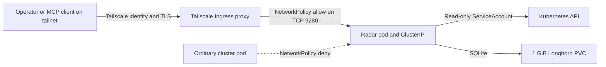

# Spec: Radar In-Cluster Deployment

| Field | Value |
|---|---|
| Status | Approved for implementation; runtime validation pending |
| Created | 2026-08-16 |
| Scope | Single-cluster, single-operator Radar OSS deployment on `talos-prod-01` |

## Purpose

Deploy Radar directly into the homelab as an always-on Kubernetes UI and MCP
server. The deployment complements the existing `kubectl` and Kubernetes MCP
paths with Radar's token-optimized issues, topology, events, logs, timeline,
and resource relationships. It is not a pre-production pilot: the homelab is
the proving ground.

This document selects the deployment and access design. It does not create
manifests, connect an MCP client, mutate the live cluster, or claim that Radar
is deployed.

## Operator Decisions

- Radar is for one operator, not a multi-user team.
- Deploy in-cluster immediately rather than running a separate local trial.
- Tailscale is the user-access boundary; do not add Radar OIDC or proxy auth.
- Enable MCP. The operator accepts responsibility for connecting clients and
  invoking tools; an agent confirmation prompt is not a security boundary.
- Use Radar's chart-managed, read-only ServiceAccount permissions. Do not grant
  Secrets, Helm writes, pod exec, port-forward, self-upgrade, or node-operation
  permissions.
- Keep pod-log reads enabled.
- Persist the timeline with SQLite on Longhorn so pod restarts do not erase
  event history.
- Pin the chart exactly and require manual review for every Radar update.
- Deploy with the repository's default automated sync, prune, and self-heal
  policy.

## Goals

1. Serve the Radar UI only through a Tailscale Ingress.
2. Serve the Radar MCP endpoint through the same trusted tailnet path.
3. Provide cluster-wide read-only topology, issue, event, resource, ArgoCD CRD,
   and pod-log visibility.
4. Persist timeline history across normal pod restarts, targeting seven days
   subject to the configured storage cap.
5. Prevent ordinary cluster workloads from bypassing Tailscale through the
   Radar ClusterIP.
6. Keep the deployment declarative and recoverable through ArgoCD.

## Non-Goals

- Multi-user authentication, per-user impersonation, or new human Kubernetes
  RBAC mappings.
- Radar Cloud or any outbound cluster-data tunnel.
- Secret browsing, Helm mutation, workload mutation, pod exec, port-forward,
  node operations, or self-upgrade through Radar.
- Installing metrics-server, Prometheus, VictoriaMetrics, OpenCost, Hubble
  Relay, or another telemetry dependency as part of this change.
- Configuring Radar's ArgoCD API token integration. Reading ArgoCD CRDs is in
  scope; deep Git-rendered diffs and token-backed GitOps actions are deferred.
- Replacing the existing `kubectl` or Kubernetes MCP servers.
- Changing Talos, Cilium, Omni, nodes, taints, or other substrate configuration.

## Evidence and Provenance

The selected chart artifact is:

| Item | Selected value |
|---|---|
| Helm repository | `https://skyhook-io.github.io/helm-charts` |
| Chart | `radar` |
| Chart version | `1.10.0` |
| App version | `1.10.0` |
| Package SHA-256 | `4b463be043617bc235f30eff79d59e7e3b5799e6e9a6d454b2b6bffce47d5e58` |

The package was downloaded and inspected on 2026-08-16. Its packaged
`Chart.yaml`, `values.yaml`, and templates agree on the values used below. The
digest is a review receipt, not an integrity pin enforced by ArgoCD; re-download
and compare it before implementation. Stop if the same version resolves to a
different artifact.

The same-day pre-deployment cluster observation found no `metrics.k8s.io`,
custom metrics, or external metrics APIService and no Prometheus,
VictoriaMetrics, OpenCost, or Hubble Relay workload. Radar's core resource,
topology, issue, timeline, and MCP functions do not depend on those services.
CPU/memory widgets, PromQL, cost, traffic, and rightsizing will remain absent or
degraded until their respective dependencies are added separately.

The live Tailscale Operator currently labels ingress proxy pods with:

```yaml
tailscale.com/managed: "true"
tailscale.com/parent-resource: <ingress-name>
tailscale.com/parent-resource-ns: <ingress-namespace>
tailscale.com/parent-resource-type: ingress
```

It also adds an `app` label whose value is a generated UUID. The UUID is not a
stable identity and must not be committed into a NetworkPolicy. Reverify the
stable labels immediately before implementation because operator-generated
metadata can change across upgrades.

## Selected Architecture



Radar runs as one replica in namespace `radar`. The chart creates the
Deployment, ClusterIP Service, ServiceAccount, read-only ClusterRole and
ClusterRoleBinding, and PVC. This repository creates the Tailscale Ingress and
NetworkPolicy locally so their behavior remains explicit and reviewable.

The root Application is named `radar`, so the nested chart Application must be
named `radar-helm`. Set `spec.source.helm.releaseName: radar` explicitly on the
child. Without that override, ArgoCD would use `radar-helm` as the Helm release
name and the rendered Service, PVC, and instance label would not match the
Ingress and NetworkPolicy contract below.

The root Application is assigned wave 6, after Tailscale and Longhorn. Inside
the Radar directory:

| Sub-wave | Resource | Reason |
|---|---|---|
| 0 | NetworkPolicy | Establish the ClusterIP boundary before a Radar pod exists |
| 1 | `radar-helm` child Application | Install the exact-pinned chart |
| 2 | Tailscale Ingress | Expose the healthy Service to the tailnet |

Wave 6 may run alongside Netdata because Radar does not depend on Netdata.

## Helm Configuration Contract

The implementation must express the following selected values explicitly even
when they match chart defaults. Explicit security and persistence choices make
future chart-default changes visible in review.

```yaml
replicaCount: 1

service:
  type: ClusterIP
  port: 9280

ingress:
  enabled: false

httpRoute:
  enabled: false

auth:
  mode: none

cloud:
  enabled: false

mcp:
  enabled: true

rbac:
  create: true
  helm: false
  secrets: false
  viewRBAC: false
  viewWebhooks: false
  podExec: false
  podLogs: true
  portForward: false
  selfUpgrade: false
  traffic: false
  metrics: false

timeline:
  storage: sqlite
  retention: 168h
  maxSize: 800Mi

persistence:
  enabled: true
  storageClassName: longhorn-standard
  accessMode: ReadWriteOnce
  size: 1Gi
```

Keep the chart's default resource requests and limits unless render or runtime
evidence shows they are unsuitable. Do not copy the chart's full CRD-group map
into this repository: the chart-managed read-only defaults cover ArgoCD,
Cilium, External Secrets, and other supported CRDs, and unused API groups are a
no-op when their CRDs are absent.

SQLite plus a ReadWriteOnce PVC causes chart 1.10.0 to render a `Recreate`
Deployment strategy and reject multiple replicas. `timeline.maxSize` remains
below the PVC size so Radar can prune before the volume fills.
`longhorn-standard` assigns the repository's weekly, four-week backup tier for
replaceable data.

## Access and Authorization Boundary

The local Ingress must use `ingressClassName: tailscale`, send `/` to Service
`radar` on port `9280`, and request the Tailscale hostname `radar`. The expected
tailnet endpoints are:

- UI: `https://radar.tailfb3ea.ts.net/`
- MCP: `https://radar.tailfb3ea.ts.net/mcp`

Radar deliberately runs with `auth.mode: none`. This is an explicit
single-operator homelab exception to Radar's upstream recommendation to enable
authentication for an ingress-exposed installation. Tailscale device/user
authorization and tailnet TLS are the external access control. Radar does not
receive a distinct Kubernetes identity for the human or MCP client, and every
request shares the pod ServiceAccount's permissions.

No User or Group RoleBinding is required. Kubernetes RBAC still matters because
it defines the maximum capability of the Radar process and every MCP caller.
Radar advertises both read and write MCP tools, but the selected ServiceAccount
cannot perform the write operations. If `rbac.helm`, `rbac.podExec`,
`rbac.portForward`, Secrets, node operations, or additional write rules are
enabled later, the MCP boundary changes and requires a separate reviewed
change.

Pod-log access is intentionally retained. Logs can contain application data
despite Radar's documented redaction, so Tailscale access to Radar also implies
access to every log the ServiceAccount may read. The operator accepts that
tradeoff for this homelab.

## NetworkPolicy Contract

The policy selects only the Radar workload:

```yaml
podSelector:
  matchLabels:
    app.kubernetes.io/name: radar
    app.kubernetes.io/instance: radar
```

It permits ingress only on TCP `9280` from one peer that combines the namespace
and pod selectors below. They must be fields of the same `from` item so
Kubernetes evaluates them as AND, not as two independently allowed sources.

```yaml
ingress:
  - from:
      - namespaceSelector:
          matchLabels:
            kubernetes.io/metadata.name: tailscale-operator
        podSelector:
          matchLabels:
            tailscale.com/managed: "true"
            tailscale.com/parent-resource: radar
            tailscale.com/parent-resource-ns: radar
            tailscale.com/parent-resource-type: ingress
    ports:
      - protocol: TCP
        port: 9280
```

Do not allow the entire `tailscale-operator` namespace and do not select the
generated `app` UUID. Do not add an ingress exception for ordinary namespaces,
monitoring pods, or all nodes without a reproduced failing path. The policy
does not restrict egress; Radar still needs the Kubernetes API and may perform
its documented anonymous version check.

The policy is fail-closed for cluster bypass: a wrong proxy selector makes the
UI unavailable rather than exposing the ClusterIP. If chart probes fail under
Cilium, capture the denied source and review the narrowest required exception
instead of guessing one in advance.

## MCP Operating Model

The personal MCP client configuration is workstation state and does not belong
in this GitOps repository. After the HTTPS endpoint is validated, the operator
may add a remote HTTP MCP server named `radar` with this URL:

```toml
[mcp_servers.radar]
url = "https://radar.tailfb3ea.ts.net/mcp"
```

Radar MCP is complementary to the existing Kubernetes MCP tools:

- Use Radar for curated issues, topology and neighborhood relationships,
  deduplicated events, change history, resource context, and filtered logs.
- Use `kubectl` or the Kubernetes MCP path for exact raw API inspection and
  operations Radar does not expose.

The personal client configuration is not part of deployment completion. The
server must be healthy and its read-only RBAC boundary proven before a client
is connected.

## Repository Change Set

Implementation is expected to create or update only these concerns:

| File | Intended change |
|---|---|
| `apps/radar/application.yaml` | Exact-pinned child Helm Application, `releaseName`, and selected values |
| `apps/radar/networkpolicy.yaml` | Pre-workload ingress isolation |
| `apps/radar/ingress.yaml` | Tailscale UI and MCP exposure |
| `apps/root.yaml` | Wave 6 parent Application and wave header |
| `renovate.json` | Radar-specific `automerge: false` override |
| `docs/architecture.md` | Wave, no-auth boundary, and version-policy exception |
| `README.md` | Application inventory and repository structure |
| `docs/tailscale-networking.md` | Only if implementation reveals a reusable proxy-label caveat |

No ExternalSecret, ClusterSecretStore, RoleBinding, or committed MCP client
configuration is required.

## Implementation Sequence

1. Re-download chart `1.10.0`, confirm its package digest, and re-check the
   selected value keys and generated labels against the packaged templates.
2. Re-read the live Tailscale ingress proxy labels and confirm the stable
   selector contract still holds.
3. Add the Radar directory with NetworkPolicy wave 0, Helm Application wave 1,
   and Tailscale Ingress wave 2. Keep the child Application name `radar-helm`
   distinct from the parent and set the Helm release name to `radar`.
4. Add the wave 6 parent Application with automated prune and self-heal plus
   `CreateNamespace=true` and `ServerSideApply=true`.
5. Add the Radar Renovate no-automerge override after the general ArgoCD patch
   rule, and document the exception in `docs/architecture.md`.
6. Update the application inventory without describing Radar as deployed until
   runtime validation succeeds.
7. Render, lint, dry-run where namespace availability permits, and run
   pre-commit on the exact changed files.
8. Publish through Git; ArgoCD's normal automated policy performs the direct
   homelab rollout. There is no separate pilot or manual-sync exception.

## Verification and Acceptance Criteria

Before publication:

- `helm template` for chart `1.10.0` renders one Deployment, one ClusterIP
  Service on `9280`, one PVC, chart-managed RBAC, and no chart Ingress or
  HTTPRoute.
- The Deployment renders `Recreate`, one replica, the SQLite arguments, the
  `/data` volume, and the chart's restricted container security context.
- The rendered ClusterRole has no Secret read, wildcard writes, pod exec,
  port-forward, or node mutation permissions; pod-log reads are present.
- The local NetworkPolicy selects the rendered Radar pod labels and only the
  observed stable Tailscale ingress proxy labels.
- Client-side schema validation accepts all local resources. Server-side
  dry-run validates the ArgoCD Applications in the existing `argocd` namespace;
  do not create the future `radar` namespace imperatively just to dry-run its
  Ingress and NetworkPolicy.
- `pre-commit run --files <exact changed files>` and `git diff --check` pass.

After ArgoCD reconciliation:

1. Parent `radar` and child `radar-helm` Applications are `Synced` and
   `Healthy`.
2. The Radar pod is ready, the `radar` PVC is `Bound` to
   `longhorn-standard`, and diagnostics report SQLite storage with the selected
   retention and size bounds.
3. `https://radar.tailfb3ea.ts.net/` loads from an authorized tailnet client.
4. The MCP endpoint completes initialization and tool listing, and a read-only
   call such as `get_dashboard` succeeds.
5. A non-matching ordinary pod cannot connect to `radar.radar.svc:9280`, while
   the Tailscale ingress proxy can.
6. ServiceAccount authorization checks prove `get pods/log` is allowed and
   `get secrets`, `create deployments`, `patch deployments`, pod exec, and
   port-forward are denied.
7. Missing metrics, cost, rightsizing, and traffic integrations degrade
   honestly without making the core UI or MCP server unhealthy.
8. After the first normal chart rollout or pod replacement, timeline events
   from before the restart remain available. Do not force an imperative restart
   solely to satisfy this check.

Record runtime results as dated evidence. ArgoCD health proves reconciliation,
not the Tailscale, NetworkPolicy, RBAC, MCP, or persistence boundaries by
itself.

## Upgrade and Renovate Policy

`targetRevision` is exactly `1.10.0`. A Radar-specific Renovate rule must set
`automerge: false` for package `radar` at every update level. This override is
deliberate even though the repository generally auto-merges chart patches:
Radar's chart couples UI behavior, MCP tool surface, ClusterRole generation,
and storage migrations, so every version requires a rendered RBAC and values
review before merge.

## Failure Handling and Rollback

- If a chart update fails but the current release is healthy, revert only the
  chart-version change so the PVC remains attached to the application.
- If the Tailscale path fails, inspect Ingress status, operator proxy labels,
  and NetworkPolicy denies. Fix Git and let ArgoCD converge; do not patch a
  broad live allow rule.
- If SQLite fails, inspect the PVC, mount, file permissions, and diagnostics.
  Do not fall back to memory silently because that violates the persistence
  decision.
- Removing the entire Radar Application under automated prune can delete its
  PVC. The timeline is classified as replaceable `longhorn-standard` data, but
  preserve a backup first if its history matters at removal time.
- If resolution requires a Cilium, Talos, Omni, node, taint, or machine-class
  change, stop and hand the substrate concern to `../Omni-Scale`.

## Deferred Follow-Up

Each of these is a separate decision and change:

- Add metrics-server for live CPU and memory widgets.
- Add Prometheus or VictoriaMetrics for PromQL and historical metrics.
- Add OpenCost for cost views.
- Add Hubble Relay or another supported source for traffic views.
- Add an Infisical-to-ESO ArgoCD token for deep Git-rendered diffs.
- Enable Radar RBAC-object visibility, Secrets, or any write capability.
- Add OIDC or proxy auth if the user population grows beyond the single
  operator or the Tailscale trust boundary changes.

## References

- [Radar in-cluster deployment](https://radarhq.io/docs/configuration/in-cluster)
- [Radar MCP documentation](https://radarhq.io/docs/features/mcp)
- [Radar chart 1.10.0 release](https://github.com/skyhook-io/helm-charts/releases/tag/radar-1.10.0)
- [Radar chart values](https://github.com/skyhook-io/helm-charts/blob/main/charts/radar/values.yaml)
- [`docs/adding-applications.md`](../docs/adding-applications.md)
- [`docs/architecture.md`](../docs/architecture.md)
- [`docs/tailscale-networking.md`](../docs/tailscale-networking.md)
- [`docs/backup-storage.md`](../docs/backup-storage.md)
